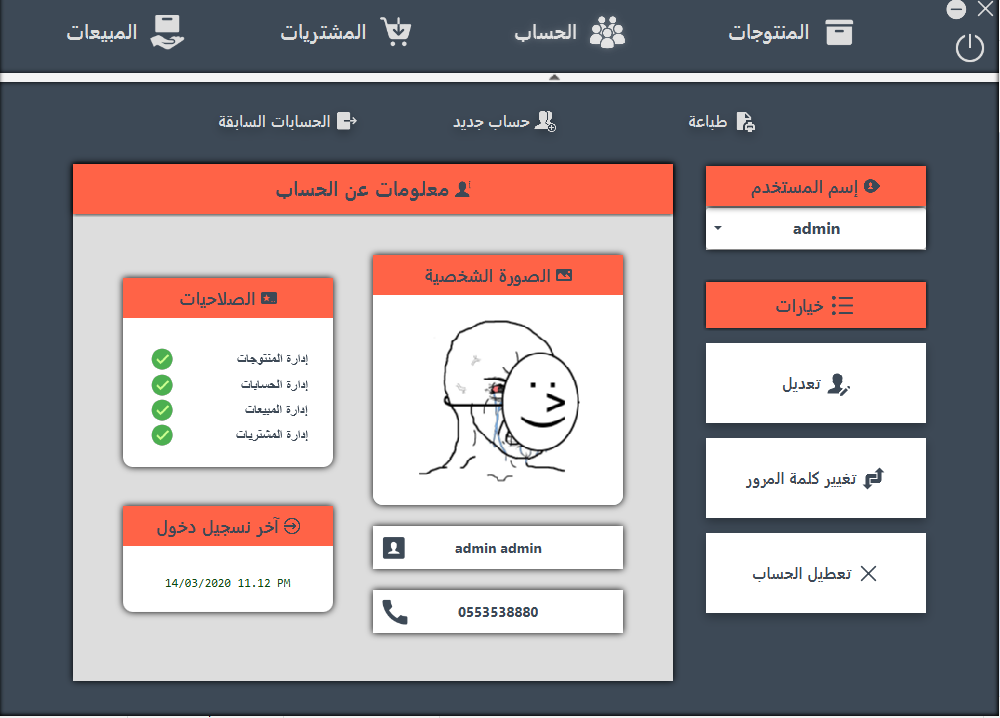
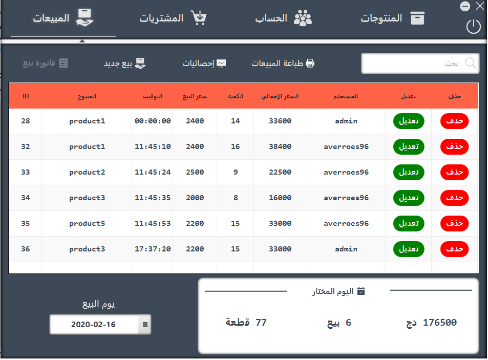
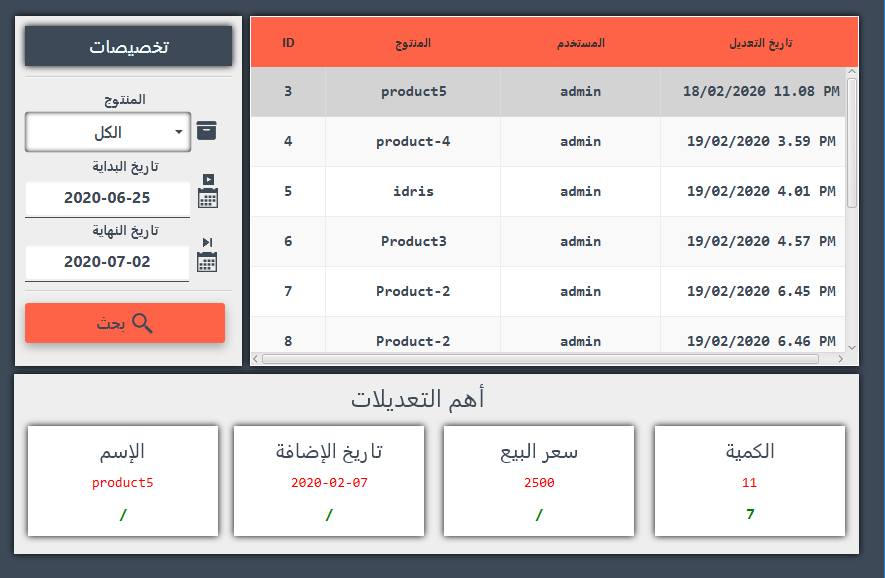

# GDP
a javaFX inventory manager app - IN ARABIC -

## IDE
[Netbeans](https://netbeans.org/)

## GUI editor
[SceneBuilder](https://gluonhq.com/products/scene-builder/)

## Used libraries
- [jfoenix-8.0.8](http://jfoenix.com/) (a JavaFX material design library)
- [commons-lang3-3.10](http://commons.apache.org/proper/commons-lang/download_lang.cgi)

## Admin login : 
  - Username : admin
  - Password : admin
  
## Important :
- Import 'gdpDB/gdp.sql' using xampp's phpMyAdmin to MySQL server.  

## Screenshots

### Users view

### Sells view

### Main view

### Product history changes view

